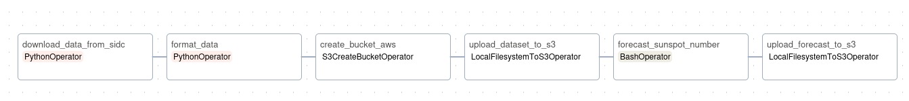
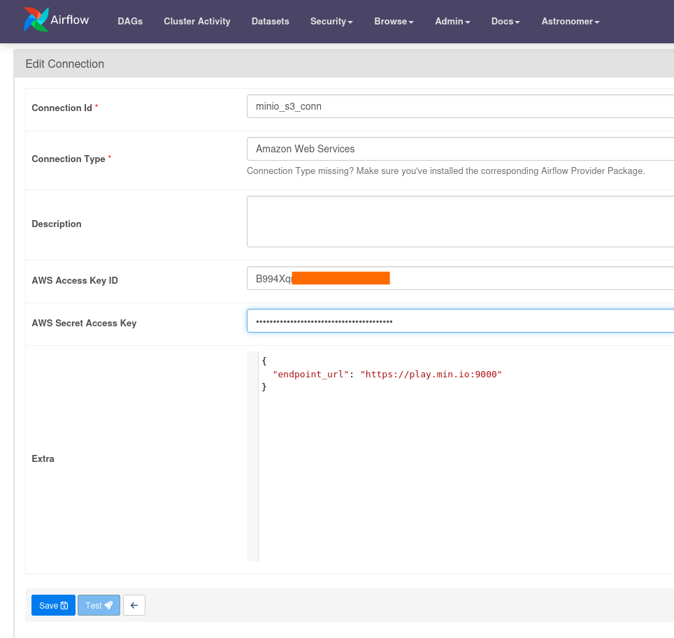
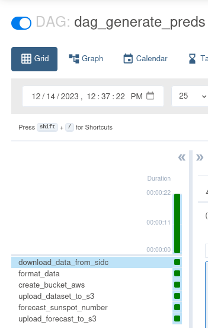
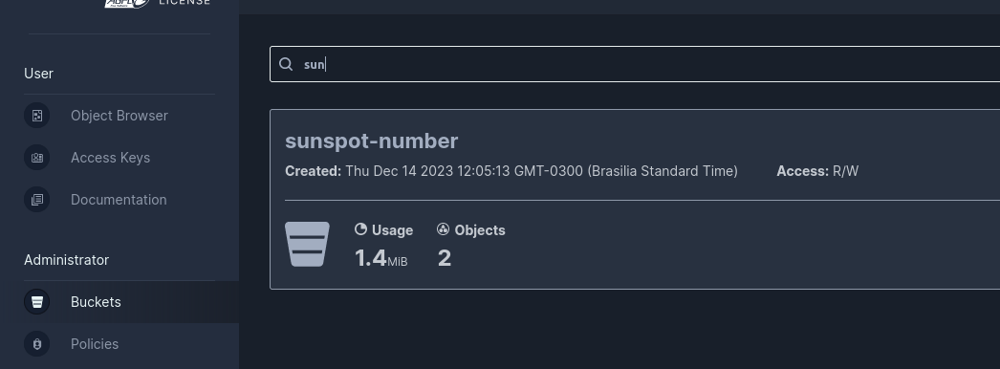
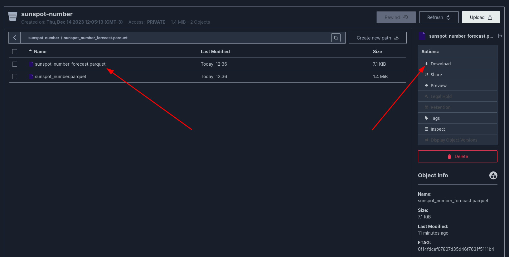
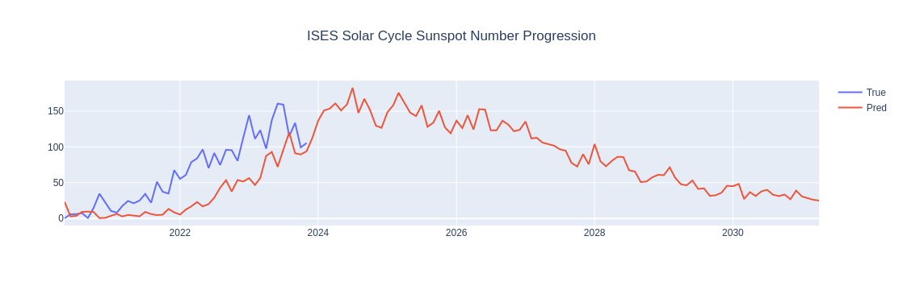

# Airflow Sunspot Number Forecast

- [Airflow Sunspot Number Forecast](#airflow-sunspot-number-forecast)
- [Introduction](#introduction)
- [Dataset](#dataset)
- [Setting up](#setting-up)
  - [Astro CLI](#astro-cli)
  - [Docker or Podman](#docker-or-podman)
  - [Minio \[Credentials\]](#minio-credentials)
- [Running Airflow Project](#running-airflow-project)
- [\[Optional\] Dashboard](#optional-dashboard)


# Introduction

**Motivation:** I watched this video [O QUE É O BURACO NO SOL QUE TEM O TAMANHO DE 60 TERRAS? - SpaceToday](https://www.youtube.com/watch?v=GkWtPBEUdDk) talking about the sunspot number be more than forecasted by the NOAA (National Oceanic and Atmospheric Administration) and this is important because results in intense magnetic activity. More info here: [Sunspot - Wikipedia](https://en.wikipedia.org/wiki/Sunspot) 

You can find the prediction provided by NOAA: [https://www.swpc.noaa.gov/communities/space-weather-enthusiasts-dashboard](https://www.swpc.noaa.gov/communities/space-weather-enthusiasts-dashboard)

I am using [Apache AirFlow](https://airflow.apache.org/) to schedule to obtain new data about the Sunspot Number Progression at a monthly frequency. Pipeline:



For forecasting, I am using the [Exponential Smoothing](https://otexts.com/fpp3/expsmooth.html) with a seasonal interval of 11 years because is the time of the cycle (see more in the Wikipedia link above)

Furthermore, I'm using [min.io](https://min.io/) to upload the results to the cloud of the forecast and [jupyter notebook](https://jupyter.org/) to show the data locally.

# Dataset

Source: WDC-SILSO, Royal Observatory of Belgium, Brussels.

# Setting up

## Astro CLI

- Step-by-Step to install the Astro CLI (Windows, MAC, and Linux) [https://docs.astronomer.io/astro/cli/install-cli](https://docs.astronomer.io/astro/cli/install-cli)

## Docker or Podman

- If you prefer Docker - [https://docs.docker.com/engine/install/](https://docs.docker.com/engine/install/)
- Or if you prefer Podman - [https://podman.io/docs/installation](https://podman.io/docs/installation)

**Note:** check how you can set up the Astro CLI for each

## Minio [Credentials]

1. Go to [https://play.min.io:9443/login](https://play.min.io:9443/login) and login to the website using the login / password: minioadmin / minionadmin

2. `Access Keys` &rarr; `Create access keys`


3. Download the keys and save the `credentials.json` locally

# Running Airflow Project

1. Clone this repository (or download the `.zip`)

```console
$ git clone https://github.com/BrenoAV/airflow-sunspot-number-forecast.git
```

2. Start the airflow project with the command: `astro dev init`. This command will create the directories and files in your project automatically that will be used for Astronomer to manage the project. Initialize a project and type `y` to confirm. Output:

```console
$ astro dev init 

Initializing Astro project
Pulling Airflow development files from Astro Runtime 9.6.0
/home/brenoav/GitHub/airflow-sunspot-number-forecast 
You are not in an empty directory. Are you sure you want to initialize a project? (y/n) y
Initialized empty Astro project in /home/brenoav/GitHub/airflow-sunspot-number-forecast
```

3. Start the project using the command: `astro dev start`

```console
...

Airflow is starting up!

Project is running! All components are now available.

Airflow Webserver: http://localhost:8080
Postgres Database: localhost:5432/postgres
The default Airflow UI credentials are: admin:admin
The default Postgres DB credentials are: postgres:postgres
```

4. Go to `Admin` &rarr; `Connections` &rarr; `Add a new record`. Put your credentials: `AWS Access Key ID` & `AWS Secret Access Key`. On the extra field, put the following "dict": `{"endpoint_url": "https://play.min.io:9000"}` and save.



5. Activate the DAG in the GUI and wait to download and process the data.



6. Go to `Minio Console` &rarr; `Buckets` and type "sunspot-number":



7. Download the `sunspot_number_forecast.parquet` file in the bucket and save in the `data/` (locally, on the project root) folder.



# [Optional] Dashboard

1. Create a virtual environment using [venv](https://docs.python.org/3/library/venv.html) or anything else:


```console
$ python -m venv venv
$ source venv/bin/activate  # unix system
$ pip install notebook plotly fastparquet==2023.10.1 pyarrow==14.0.1 statsmodels==0.14.0
```

2. Open Jupyter Notebook and go to [notebooks/Results.ipynb](notebooks/Results.ipynb)

```console
$ jupyter notebook
```

3. Execute all the cells and generate the final predictions graph



---

<p align='center'>
<strong>MIT License</strong><br>
This project is licensed under the MIT License - see the LICENSE file for details.<br><br>
&copy; 2023 BrenoAV
</p>