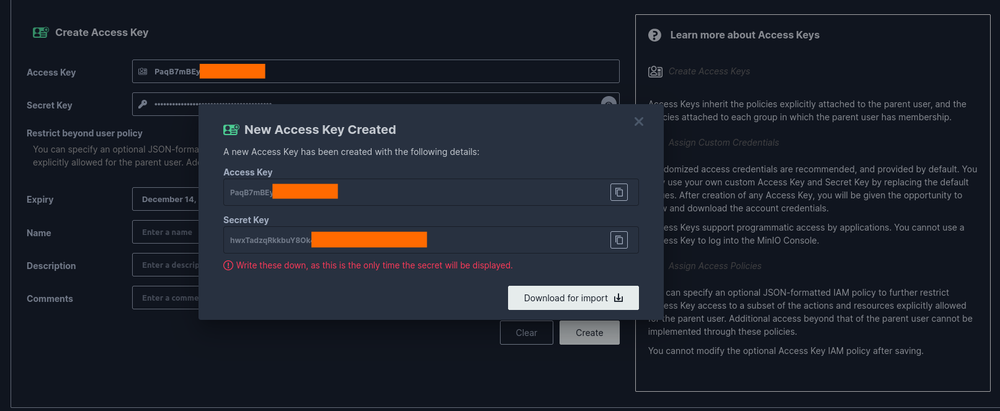

# Airflow Sunspot Number Forecast


# Setting up

## Astro CLI

- Step-by-Step to install the Astro CLI (Windows, MAC, and Linux) [https://docs.astronomer.io/astro/cli/install-cli](https://docs.astronomer.io/astro/cli/install-cli)

## Docker or Podman

- If you prefer Docker - [https://docs.docker.com/engine/install/](https://docs.docker.com/engine/install/)
- Or if you prefer Podman - [https://podman.io/docs/installation](https://podman.io/docs/installation)

**Note:** check how you can set up the Astro CLI for each

## Minio [Credentials]

1. Go to [https://play.min.io:9443/login](https://play.min.io:9443/login) and login to the website using the login / password: minioadmin / minionadmin

2. `Access Keys` &rarr; `Create access keys`



3. Download the keys and save the `credentials.json` locally

# Running

1. Clone this repository (or download the `.zip`)

```console
$ git clone https://github.com/BrenoAV/airflow-sunspot-number-forecast.git
```

2. Start the airflow project with the command: `astro dev init`. This command will create the directories and files in your project automatically that will be used for Astronomer to manage the project. Initialize a project and type `y` to confirm. Output:

```console
$ astro dev init 

Initializing Astro project
Pulling Airflow development files from Astro Runtime 9.6.0
/home/brenoav/GitHub/airflow-sunspot-number-forecast 
You are not in an empty directory. Are you sure you want to initialize a project? (y/n) y
Initialized empty Astro project in /home/brenoav/GitHub/airflow-sunspot-number-forecast
```

3. Start the project using the command: `astro dev start`

```console
...

Airflow is starting up!

Project is running! All components are now available.

Airflow Webserver: http://localhost:8080
Postgres Database: localhost:5432/postgres
The default Airflow UI credentials are: admin:admin
The default Postgres DB credentials are: postgres:postgres
```

4. Go to `Admin` &rarr; `Connections` &rarr; `Add new connection`. Put your credentials: `AWS Access Key ID` & `AWS Secret Access Key`. On the extra field, put the following "dict": `{"endpoint_url": "https://play.min.io:9000"}` and save.

